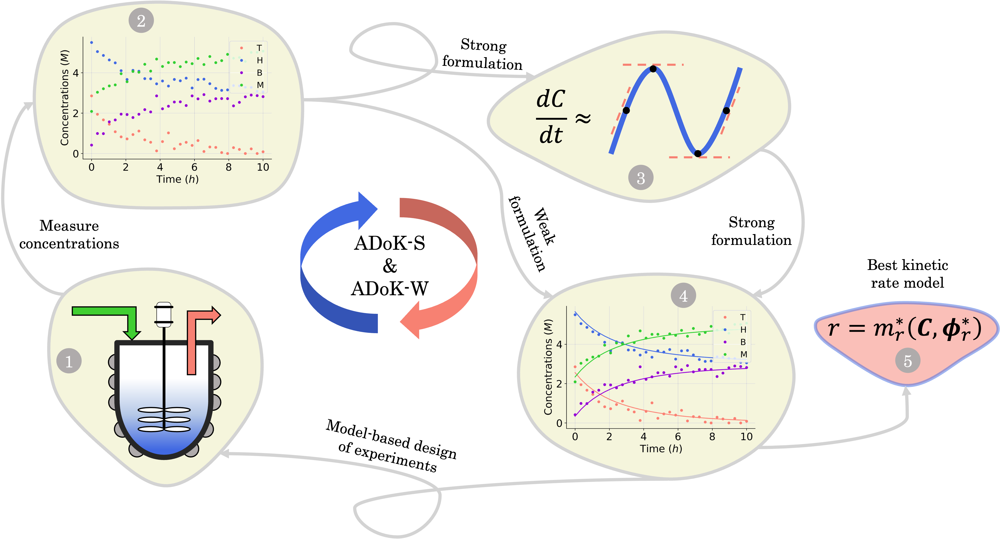

# The Automated Discovery of Kinetic Rate Models - Methodological Frameworks

The industrialization of catalytic processes requires reliable kinetic models for their design, optimization and control. Mechanistic models require significant domain knowledge, while data-driven and hybrid models lack interpretability. Automated knowledge discovery methods, such as ALAMO, SINDy, and genetic programming, have gained popularity but suffer from limitations such as needing model structure assumptions, exhibiting poor scalability, and displaying sensitivity to noise. To overcome these challenges, we propose two methodological frameworks, ADoK-S and ADoK-W, for the automated generation of catalytic kinetic models using a robust criterion for model selection. We leverage genetic programming for model generation and a sequential optimization routine for model refinement. The frameworks are tested against three case studies of increasing complexity, demonstrating their ability to retrieve the underlying kinetic rate model with limited noisy data from the catalytic systems, showcasing their potential for chemical reaction engineering applications.

